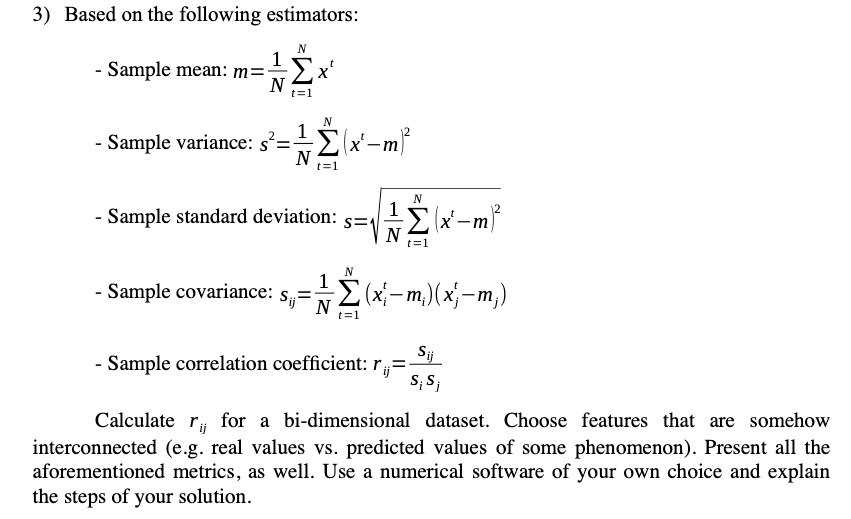

Assignment 1 Question 3

# The dataset
The dataset choosen was Energy efficiency Data Set (https://archive.ics.uci.edu/ml/datasets/Energy+efficiency)

The dataset perform energy analysis using 12 different building shapes simulated in Ecotect. The buildings differ with respect to the glazing area, the glazing area distribution, and the orientation, amongst other parameters. We simulate various settings as functions of the afore-mentioned characteristics to obtain 768 building shapes. The dataset comprises 768 samples and 8 features, aiming to predict two real valued responses. It can also be used as a multi-class classification problem if the response is rounded to the nearest integer.

 A. Tsanas, A. Xifara: 'Accurate quantitative estimation of energy performance of residential buildings using statistical machine learning tools', Energy and Buildings, Vol. 49, pp. 560-567, 2012

 # Features choosen for computing correlation

The assignment requests that two features are choosen in order to check their correlation.

The features choosen were: `X2 (Surface Area)` and  `X4 (Roof Area)`.

 # Steps for execution

1. Make sure you're inside the `assigment1/` folder;

2. Run the command `python3 assignment1.py`;